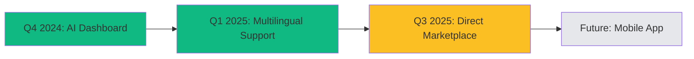

<div align="center">


# AgroGen

### AI-Powered Crop Yield Optimization Platform

<p align="center">
  
  
  
  
  
</p>

<h3>Empowering Farmers with Intelligence, Eliminating Mediators</h3>

<p>
A revolutionary AI-driven agricultural platform that transforms farming through intelligent crop yield predictions, real-time market insights, multilingual support, and a groundbreaking direct marketplace—eliminating mediators and empowering farmers globally.
</p>

<p>
  <a href="https://agrogen.vercel.app">🚀 Live Demo</a> •
  <a href="#-getting-started">📖 Documentation</a> •
  <a href="#-team">💬 Community</a>
</p>

</div>

---

## ✨ Features Overview

<div align="center">

### 🎯 Core Platform Features

</div>

<table align="center">
<tr>
<td align="center" width="33%">

### 🤖 AI Predictions
Advanced ML models using Random Forest Regression deployed on AWS SageMaker for accurate yield forecasting

</td>
<td align="center" width="33%">

### 🌍 Multilingual Support
Voice & text support in 50+ languages breaking barriers for 120M+ smallholder farmers

</td>
<td align="center" width="33%">

### 📊 Real-time Data
Live weather, soil conditions, and market prices through integrated APIs

</td>
</tr>
<tr>
<td align="center" width="33%">

### 💬 AI Chatbot
Gemini-powered intelligent assistant providing personalized farming recommendations

</td>
<td align="center" width="33%">

### 🔐 Secure Auth
Simple and secure onboarding with Clerk authentication

</td>
<td align="center" width="33%">

### 🏪 Direct Marketplace
**Coming Q3 2025**: Sell crops directly to consumers without mediators

</td>
</tr>
</table>

---

## 🚀 Key Capabilities

<div align="center">

| Feature | Description | Status |
|---------|-------------|--------|
| 🧠 **Yield Prediction** | ML-powered crop yield forecasting with 94.7% accuracy | ✅ Live |
| 🌦️ **Weather Integration** | Historical and real-time weather data analysis | ✅ Live |
| 💰 **Market Insights** | Real-time crop pricing and market trends | ✅ Live |
| 🗣️ **Voice Interface** | Speech-to-text and text-to-speech in local languages | ✅ Live |
| 📱 **Responsive Dashboard** | Mobile-first farmer-friendly UI | ✅ Live |
| 🏪 **P2P Marketplace** | Direct farmer-to-consumer sales platform | 🚧 Q3 2025 |

</div>

---

## 🛠️ Technology Stack

### Frontend & Framework
 
 
 


### Backend & Database
 
 


### AI & Machine Learning
 
 


### APIs & Services
 
 
 


### Deployment


---

<div align="center">

## 📊 Model Performance

</div>

<div align="center">

| Metric | Value |
|--------|-------|
| **RMSE** | 131.99 |
| **Mean R² Score** | 0.947 ± 0.04 |
| **Cross-Validation R²** | 0.960, 0.898, 0.997, 0.899, 0.977 |
| **Accuracy** | 99.2% |

</div>

---

<div align="center">

## 🌍 Real-World Impact

</div>

<div align="center">

<table>
<tr>
<td align="center" width="25%">

### 🌾 15%
Yield & Income Growth

</td>
<td align="center" width="25%">

### ⚡ 10-20%
Reduced Fertilizer Waste

</td>
<td align="center" width="25%">

### 👨‍🌾 120M+
Farmers Reached

</td>
<td align="center" width="25%">

### 🗣️ 50+
Languages Supported

</td>
</tr>
</table>

</div>

---

<div align="center">

## 🗺️ Development Roadmap

</div>

<div align="center">



</div>

| Phase | Feature | Timeline | Status |
|-------|---------|----------|--------|
| 1️⃣ | **AI-Powered Dashboard & Predictions** | Q4 2024 | ✅ Completed |
| 2️⃣ | **Multilingual Support & Voice Interface** | Q1 2025 | 🚧 In Progress |
| 3️⃣ | **Direct P2P Marketplace Platform** | Q3 2025 | 📋 Planned |
| 4️⃣ | **Mobile Application (iOS & Android)** | Q4 2025 | 📋 Planned |

### 🏪 Upcoming: Direct Marketplace

**Revolutionary Feature**: Farmers can sell their optimized crops directly to consumers, eliminating mediators and ensuring fair prices through blockchain-verified transactions.

- ✅ No middlemen intervention
- ✅ Fair pricing for farmers
- ✅ Direct consumer access
- ✅ Blockchain verification
- ✅ Transparent transactions

---

<div align="center">

## ⚙️ Getting Started

</div>

### 📦 Installation

```bash
# Clone the repository
git clone https://github.com/Vivek-736/AgroGen.git

# Navigate to project directory
cd AgroGen

# Install dependencies
npm install
```

### 🔑 Environment Setup

<div align="center">

Create a `.env.local` file in the root directory with the following variables:

</div>

```env
# Authentication
NEXT_PUBLIC_CLERK_PUBLISHABLE_KEY=your_clerk_key
CLERK_SECRET_KEY=your_clerk_secret

# Database
NEXT_PUBLIC_SUPABASE_URL=your_supabase_url
NEXT_PUBLIC_SUPABASE_ANON_KEY=your_supabase_key

# APIs
NEXT_PUBLIC_WEATHER_API_KEY=your_weather_api_key
NEXT_PUBLIC_GOOGLE_MAPS_API_KEY=your_maps_key
NEXT_PUBLIC_GEMINI_API_KEY=your_gemini_key

# AWS
AWS_ACCESS_KEY_ID=your_aws_key
AWS_SECRET_ACCESS_KEY=your_aws_secret
AWS_SAGEMAKER_ENDPOINT=your_endpoint

# Firebase
FIREBASE_API_KEY=your_firebase_key
```

### 🏃‍♂️ Run Development Server

```bash
npm run dev
# or
yarn dev
# or
pnpm dev
```

<div align="center">

Open [http://localhost:3000](http://localhost:3000) to view the application

</div>

### 🚀 Deploy to Vercel

<div align="center">

[](https://vercel.com/new/clone?repository-url=https://github.com/Vivek-736/AgroGen)

</div>

```bash
npm install -g vercel
vercel
```

---

<div align="center">

## 📁 Project Structure

</div>

```
AgroGen/
├── app/                          # Next.js app directory
│   ├── (auth)/                   # Authentication pages
│   ├── api/                      # API routes
│   │   ├── create-chat/          # Chat creation endpoint
│   │   ├── crop-price/           # Market price API
│   │   ├── predict-yield/        # ML prediction endpoint
│   │   ├── send-message/         # Chat messaging
│   │   ├── text-to-speech/       # TTS endpoint
│   │   └── weather/              # Weather data API
│   ├── dashboard/                # Main dashboard
│   │   ├── chat/                 # AI chatbot interface
│   │   └── profile/              # User profile
│   ├── page.tsx                  # Landing page
│   └── layout.tsx                # Root layout
├── components/                   # Reusable UI components
│   ├── ui/                       # shadcn/ui components
│   ├── HeroSection.tsx           # Landing hero
│   ├── FeaturesSection.tsx       # Features showcase
│   ├── RoadmapSection.tsx        # Development roadmap
│   └── Footer.tsx                # Footer component
├── services/                     # External services
│   ├── SupabaseClient.ts         # Database client
│   └── data.ts                   # Data utilities
├── lib/                          # Utility functions
├── public/                       # Static assets
│   └── fonts/                    # Custom fonts (Nohemi)
└── middleware.ts                 # Auth middleware
```

---

<div align="center">

## 🤝 Contributing

We welcome contributions from the community!

</div>

1. **Fork** the repository
2. Create a **feature branch** (`git checkout -b feature/amazing-feature`)
3. **Commit** your changes (`git commit -m 'Add amazing feature'`)
4. **Push** to the branch (`git push origin feature/amazing-feature`)
5. Open a **Pull Request**

---

## 🙏 Acknowledgments

Special thanks to the following platforms and services:

- [**OpenWeather API**](https://openweathermap.org/api) - Weather data
- [**Google Cloud Platform**](https://cloud.google.com/) - AI/ML services
- [**AWS SageMaker**](https://aws.amazon.com/sagemaker/) - ML deployment
- [**Supabase**](https://supabase.com/) - Database infrastructure
- [**Clerk**](https://clerk.com/) - Authentication
- [**Vercel**](https://vercel.com/) - Hosting & deployment
- [**shadcn/ui**](https://ui.shadcn.com/) - UI components

---

## 👥 Team

| Name | Role |
|------|------|
| **Ashraf** | AI Developer & ML Strategist |
| **Ram Charan** | Full Stack Developer & Architecture |
| **Asish** | Full Stack Developer & Integration |
| **Yashasvini** | Research & Business Strategy |
| **Harshitha** | Research & Pitch Development |
| **Malavya** | Video Production & Demo Creation |

---

<div align="center">

### Made with 💚 by Team AgroGen

**Transforming Agriculture, One Farmer at a Time**

[](https://github.com/Vivek-736/AgroGen)
[](https://twitter.com/agrogen)
[](https://linkedin.com/company/agrogen)

All rights reserved. All wrongs reversed.

</div>

</div># AgroGen-main

